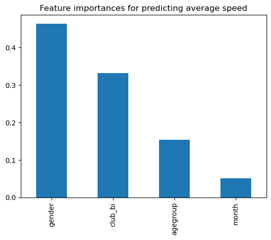
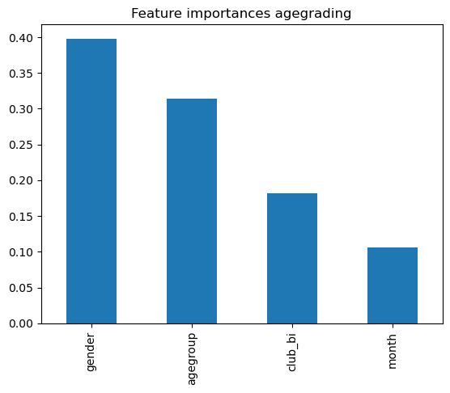

# Predicting Performance with Random Forest Regression
I also want to try to predict performances and see what the most useful predictors are. We are going to use Random Forest Regression to achieve this.


```python
import pandas as pd
import numpy as np
import matplotlib.pyplot as plt
import sklearn
import warnings

from sklearn.preprocessing import LabelEncoder
from sklearn.ensemble import RandomForestRegressor
from sklearn.metrics import mean_squared_error, r2_score
from scipy.stats import randint

warnings.filterwarnings('ignore')
```


```python
df = pd.read_csv('5k_full_results_clean.csv')

# create a binary club variable
df['club_bi'] = df['club'].apply(lambda x: 'no club runner' if x == 'no club' else 'club runner')

df['club_bi'].value_counts()
```


    no club runner    3335
    club runner        702
    Name: club_bi, dtype: int64


We don't need all the columns here and we also want to separate the data into the predictors and the target variable.

There are four reasonable predictors in the dataset:
* gender: our EDA showed that men are faster than women this should at least be a good pedictor for average speed (if not necessarily for age grading)
* agegroup: again, in the EDA we saw that age plays a role in avg speed, but less so in the age grading
* club: we saw that club runners are faster than non club runners
* month: in the EDA we looked at performance by season. There were some differences, I include month here for a more fine grained analysis


```python
# predictors
X1 = df[['agegroup', 'gender', 'club_bi', 'month']]

# target variables
y1 = df['avg_speed_kph']
```

The regression model need numeric data so we transform it here.


```python
# transform categorical data into numeric data
label_encoder = LabelEncoder()
x1_cat = X1.select_dtypes(include=['object']).apply(label_encoder.fit_transform)
x1_num = X1.select_dtypes(exclude=['object']).values

x1 = pd.concat([pd.DataFrame(x1_num), x1_cat], axis=1).values
```


```python
regressor_avg_speed = RandomForestRegressor(n_estimators=10, random_state=0, oob_score=True)

# fit regressor for avg speed
regressor_avg_speed.fit(x1, y1)
```


    RandomForestRegressor(n_estimators=10, oob_score=True, random_state=0)


We are going to compute three metrics to eveluate the model performance:
* Out-of-Bag (OOB) score: describes how well the model predicts unseen data. Ranging from 0 to 1, higher values indicate a better model. In some cases the OOB can also be negative.
* Mean-Squared-Error (MSE): describes how far the predictions are from the true values. Raning from 0 to infinity, smaller values are better. However, this value is sensitive to the scale of the predicted variable.
* R-Squared (R2) score: describes how much of the variance in the data can be explained by the model. Ranges from 0 to 1 but can also be negative. The higher the value the better the model fit.


```python
oob_score = regressor_avg_speed.oob_score_
print(f'Out-of-Bag Score: {oob_score}')

predictions = regressor_avg_speed.predict(x1)

mse = mean_squared_error(y1, predictions)
print(f'Mean Squared Error: {mse}')

r2 = r2_score(y1, predictions)
print(f'R-squared: {r2}')
```

    Out-of-Bag Score: 0.19529141884590617
    Mean Squared Error: 3.4407791398919976
    R-squared: 0.5156618574142351


### Model evaluation

**OOB-Score**: The OOB-Score is on the lower side of the scale which indicates a potential overfit.

**MSE**: The MSE-score doesn't seem too high, but given the scale for average speed in our data is probably ~4-16, it is also not a very good value.

**R2**: The R2-score is right in the middle, indicating, that around half the variance in the data can be explained by the model. This is a decent but not very good value.

### Feature immportance
Let's now see how important the four predicting variables were for predicting the times:

The most important variable to predict running speed is gender followed by club affiliation. This confirms the results of the exploratory data analysis.


```python
feature_importances = pd.Series(regressor_avg_speed.feature_importances_, index=X1.columns).sort_values(ascending=False)
feature_importances.plot(kind='bar')
plt.title('Feature importances for predicting average speed')
plt.show()
```


    

    


## Repeat everything for age grading
Unlike for avg speed we have some NA values in the age graded column. It is not possible to impute these values because we don't have any information about the age and gender of these runners. Therefore we will remove them.


```python
df['age_grade'].isna().sum()
```


    132


```python
df_x = df.loc[~df['age_grade'].isna()].reset_index(drop=True)

# predictors
X2 = df_x[['agegroup', 'gender', 'club_bi', 'month']]

# target variables
y2 = df_x['age_grade']
```


```python
# transform categorical data into numeric data
label_encoder = LabelEncoder()
x2_cat = X2.select_dtypes(include=['object']).apply(label_encoder.fit_transform)
x2_num = X2.select_dtypes(exclude=['object']).values

x2 = pd.concat([pd.DataFrame(x2_num), x2_cat], axis=1).values
```


```python
regressor_agegrade = RandomForestRegressor(n_estimators=10, random_state=0, oob_score=True)

regressor_agegrade.fit(x2, y2)
```


    RandomForestRegressor(n_estimators=10, oob_score=True, random_state=0)


```python
oob = regressor_agegrade.oob_score_

y2_preds = regressor_agegrade.predict(x2)

mse = mean_squared_error(y2, y2_preds)

r2 = r2_score(y2, y2_preds)

print(f'Out-of-Bag score: {oob}\nMean Squared Error: {mse}\nR-Squared: {r2}')
```

    Out-of-Bag score: -0.1805173777379936
    Mean Squared Error: 88.46949771003116
    R-Squared: 0.3246058923319859


### Model evaluation

**OOB-Score:** In this case we have a negative OOB-Score, indicating a fairly poor model performance.
**MSE:** The MSE is pretty high (we are ranging on a potential scale from 0-100) so an MSE of 88 is pretty bad.
**R2:** While the R2 of 0.32 is not terribly bad, it is still on the worse side of the data.

The reason the model performs worse is quite likely, that the age graded performance is meant to be a metric that makes running performance comparable agross age groups and gender, which makes it harder to predict.

### Feature importance
We can see that even though the age grading is meant to make running performance comparable across agegroup and gender, these two variables are still the most important in predicting performance. However, the generally bad performance of the model doesn't deliver very reliable results.


```python
feature_importances_agegrade = pd.Series(regressor_agegrade.feature_importances_, index=X2.columns).sort_values(ascending=False)
feature_importances_agegrade.plot(kind='bar')
plt.title('Feature importances agegrading')
plt.show()
```


    

    

